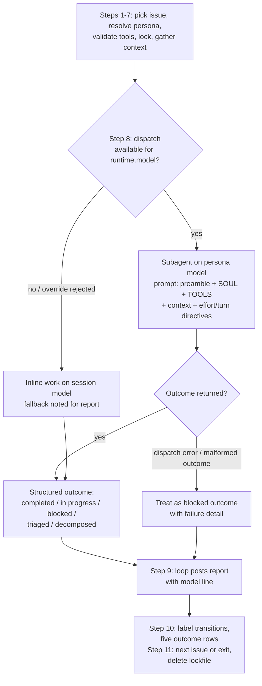

# Enforce Persona Model via Subagent Dispatch - Plan

## Goal Capsule

- **Objective:** A heartbeat run executes each issue's persona work on the model named in that persona's `runtime.model`, by dispatching the Do Work step to a subagent with a model override.
- **Product authority:** GitHub issue #8 and the Product Contract below. `docs/specs/2026-03-25-woterclip-design.md` records the original dispatch intent ("The heartbeat passes these as flags when dispatching work"). Process authority is AGENTS.md safety-critical tier: validate-first on every unit, mandatory code review before merge.
- **Execution profile:** For each unit, state the observable check first, make the edit, then run the check — in separate steps.
- **Stop conditions:** Stop and return to planning if an edit would (a) change the `templates/config.yaml` schema (version bump + init migration are out of scope), (b) break the `agent-working`/`agent-blocked` mutual exclusion or any lockfile-delete exit path, or (c) renumber the heartbeat's 11 steps (step numbers are hand-cited in `references/label-conventions.md`, `references/sub-issues.md`, `commands/heartbeat.md`, and `skills/init/SKILL.md`).
- **Open blockers:** none.

---

## Product Contract

Product Contract preservation — changed from the requirements-only version: R1 amended (dispatch prompt opens with a loop-authored state-ownership preamble), R3 amended (outcome set widened from three statuses to the five in `references/status-mapping.md`), R9 added (persona TOOLS.md alignment), Dependencies / Assumptions extended (environment inheritance, per-call isolation). Flow analysis found the verbatim-injected TOOLS.md templates would otherwise instruct the subagent to post heartbeat comments and edit state labels, violating R4.

### Summary

Move the heartbeat's Do Work step into a dispatched subagent that runs on the persona's configured model, with SOUL.md, TOOLS.md, and issue context injected into its prompt and `thinking_effort`/`max_turns` passed as effort/budget guidance. The orchestrating loop keeps everything stateful — issue pick-up, lockfile, label transitions, and the report comment — and falls back to inline work (disclosed in the report) when dispatch is unavailable.

### Problem Frame

Every persona config declares `runtime.model` (Orchestrator `haiku`, CEO/Frontend `sonnet`, Backend `opus`), chosen to balance cost against task complexity. But the heartbeat is a skill the current session follows inline, and a session cannot switch its own model, so `skills/heartbeat/SKILL.md` marks the field "informational; cannot switch mid-session". Whatever model launched the session does all the work: a haiku session does opus-tier backend implementation, an opus session burns opus tokens on mechanical triage. The design spec intended dispatch-time flags; the field's promise was never wired up.

### Key Decisions

- **Work-step-only dispatch boundary.** Only Step 8 (Do Work) moves into the subagent. The loop keeps inbox scan, persona resolution, tool validation, locking, label transitions, report posting, and lockfile handling. Chosen so the label state machine and heartbeat counter keep a single writer — a subagent crash cannot strand `agent-working` or a half-posted report.
- **Dynamic persona injection over static agent files.** The dispatch prompt is composed at runtime from the persona files Step 4 already loads. Scaffolding per-persona agent files with `model` frontmatter would duplicate persona identity and require an init migration for every scaffolded repo; the existing standalone `agents/orchestrator.md` is untouched.
- **Inline fallback with disclosure over hard-blocking.** When dispatch or the model override is unavailable, the work runs inline on the session model and the report says so. The plugin keeps working in harnesses without a subagent primitive, and the Board can audit degraded routing.
- **Model is enforced; effort and turns are guidance.** `runtime.model` rides the dispatch's model parameter. `thinking_effort` and `max_turns` are injected into the subagent prompt as directives, since dispatch primitives do not reliably expose them. No config schema change follows from this.

### Actors

- A1. **Heartbeat session** — the orchestrating loop; sole writer of heartbeat state (labels, report comments, lockfile).
- A2. **Persona subagent** — dispatched per issue on the persona's model; does the work and returns a structured outcome.
- A3. **Board** — human reading heartbeat reports; sees which model did the work and when routing degraded.

### Requirements

**Dispatch**

- R1. Do Work runs in a subagent whose model is set from the persona's `runtime.model`, with a prompt composed from a loop-authored state-ownership preamble, the persona's SOUL.md and TOOLS.md, and the issue context gathered by the loop; the preamble supersedes any persona-file instruction to write loop-owned state.
- R2. The dispatch prompt carries `thinking_effort` as an effort directive and `max_turns` as a turn-budget directive.
- R3. The subagent performs the work itself — including work-product GitHub mutations such as commits, PRs, triage persona-label edits, and sub-issue creation — and returns a structured outcome whose status is one of the five heartbeat outcomes in `references/status-mapping.md`, with the detail the loop needs to report (contract in KTD3).

**State ownership**

- R4. The loop remains the only writer of heartbeat state: `agent-working`/`agent-blocked` transitions, status labels, the report comment, the heartbeat counter, and lockfile create/delete.
- R5. A subagent failure or blocked outcome routes through the existing Step 10 transitions, and every exit path — including new dispatch-failure paths — still deletes the lockfile.
- R9. Persona TOOLS.md templates direct personas to return outcomes to the loop; they no longer instruct posting heartbeat comments or editing `agent-working`/`agent-blocked` labels.

**Fallback**

- R6. When the harness has no subagent primitive or rejects the model override, the loop does the work inline on the session model and continues; the issue is not blocked for this reason alone.
- R7. The report comment always names the model that performed the work; on fallback it names both configured and actual (e.g. "sonnet (fallback — configured: opus)").

**Documentation consistency**

- R8. `skills/heartbeat/SKILL.md` no longer describes `model` as informational; `references/comment-format.md` gains the model line; README.md and CLAUDE.md stay consistent with dispatch semantics.

### Acceptance Examples

- AE1. **Covers R1, R7.** Given a `backend` issue and a harness with subagent dispatch, when the heartbeat processes it, the work runs on `opus` and the report comment includes a model line naming `opus`.
- AE2. **Covers R6, R7.** Given the same issue in a harness without dispatch, when the heartbeat processes it, the work completes inline and the report's model line reads as a disclosed fallback with both models named.
- AE3. **Covers R3, R5.** Given a subagent that returns a blocked outcome (or dies mid-work), when the loop resumes, it posts the blocked comment, swaps `agent-working` for `agent-blocked`, and the lockfile is gone after exit.
- AE4. **Covers R3, R4, R9.** Given an unlabeled issue routed to the Orchestrator, the subagent applies the persona label as work product and returns a triaged outcome; the loop posts the only Heartbeat-formatted comment, so counter parsing sees exactly one new `Heartbeat #N`.
- AE5. **Covers R3, KTD5.** Given a Backend subagent that needs CEO input, it swaps the persona label to `ceo` as work product and returns an in-progress outcome; the loop keeps `agent-working` and posts no Board mention.

### Scope Boundaries

- No config schema change: `runtime.*` fields keep their current shape, so no `version` bump and no init migration.
- No per-persona strictness flag (`model_strict`) — rejected in favor of uniform fallback-with-disclosure.
- No per-persona batching or parallel dispatch; issue pick-up order is unchanged.
- No hard enforcement of `max_turns` or `thinking_effort`; `enable_chrome`, `timeout`, and `extra_args` are untouched — a hung subagent has no timeout protection in this iteration (see KTD6).
- No tool-grant restriction on the dispatched subagent; "never writes code" personas remain governed by SOUL.md prose (see KTD6).
- Persona `config.yaml` rationale comments are unchanged (still accurate under enforcement); `escalates_to` stays decorative (unread by the heartbeat, as today).
- Regenerating TOOLS.md in already-scaffolded repos is deferred to a follow-up init issue; existing scaffolds and imported or custom personas are covered at dispatch time by the state-ownership preamble.
- The dangling quiet-hours cross-reference in Step 1 of `skills/heartbeat/SKILL.md` is a pre-existing prose nit, deferred.

### Dependencies / Assumptions

- The host harness's subagent dispatch accepts a per-dispatch model override (current Claude Code Task/Agent dispatch does); where it doesn't, R6 governs.
- The dispatched subagent inherits the loop's execution environment — same filesystem, git credentials, and `gh` auth — so Step 5's tool validation remains meaningful for the work environment.
- Each dispatch is a fresh, memoryless subagent instance; no persona context bleeds between issues in a multi-issue run.
- Heartbeat counter parsing stays valid because the dispatch preamble forbids the subagent from posting Heartbeat-formatted comments regardless of persona-file vintage or provenance; R9 additionally cleans the shipped templates so fresh scaffolds stop carrying the contradiction.

### Sources / Research

- `docs/specs/2026-03-25-woterclip-design.md:180-192` — per-persona runtime table and the dispatch intent this plan realizes.
- `skills/heartbeat/SKILL.md` — 11 steps, 1,468 words; lockfile-delete exit paths at lines 31, 34, 64, 88, 124, 159; the "informational" note at line 76.
- `references/status-mapping.md:18-26` — the five heartbeat outcomes (completed, in progress, blocked, triaged, decomposed) with their label transitions; authority for the outcome contract.
- `references/comment-format.md` — report and blocked templates (no model line today); counter derivation rules.
- `templates/personas/*/TOOLS.md` — currently instruct posting heartbeat comments and applying `agent-blocked` directly (the R9 conflict).
- `docs/solutions/architecture-patterns/linear-to-github-tracker-swap.md` — migration lesson: a config value-meaning change without an explicit sweep broke every scaffolded repo; motivates the no-schema-change boundary.
- `agents/orchestrator.md` — standalone agent, `description` + `tools` frontmatter only, not part of the heartbeat.

---

## Planning Contract

### Key Technical Decisions

- **KTD1. Fold dispatch inside Step 8; never renumber.** Heartbeat step numbers are hand-cited in four other files with no single source of truth. The step count stays 11; dispatch is internal branching within Step 8, with supporting edits inside Steps 4 and 9.
- **KTD2. House the dispatch procedure in a new `references/persona-dispatch.md`.** SKILL.md sits at 1,468 of its 2,000-word budget; the dispatch prompt composition, outcome contract, and fallback rules would crowd it. The four existing references (55–90 lines each) set the size and wiring convention: declare once in SKILL.md's "Reference files" block, re-cite inline at Step 8.
- **KTD3. Outcome contract = the five statuses of `references/status-mapping.md`, not a new taxonomy.** The subagent returns: status (completed | in progress | blocked | triaged | decomposed), work summary, commit SHAs / PR URLs, sub-issues created, blocker description and action needed (blocked only), escalation target (when a persona label was swapped), and model used. The loop maps status to the label transitions `references/status-mapping.md` already defines; Step 10's table gains `triaged` and `decomposed` rows to carry them — including an explicit `agent-working` removal on the triage handoff — and Step 9's heartbeat-log status enum widens to the same five values. Rows are added and nothing renumbers, so KTD1 holds.
- **KTD4. Fallback detection is per dispatch call, not per run.** Model-specific rejection (opus unavailable while haiku works) is the realistic failure mode; a run-level check would force every issue inline during a single-model outage. Step 8 attempts dispatch for each issue and falls back individually.
- **KTD5. Worker→CEO escalation is a work-product persona-label swap reported as in progress.** No `agent-blocked`, no Board @-mention; the CEO persona picks the issue up on a later heartbeat via normal inbox routing. `agent-blocked` + Board mention remains reserved for genuine external blockers.
- **KTD6. Two disclosed limitations, accepted.** (a) Dispatch is synchronous with no timeout: a hung subagent strands the run until the next heartbeat's stale-lock cleanup; persona `timeout` stays unread. (b) No tool-grant scoping per persona: role restrictions stay SOUL.md prose. Both are stated in `references/persona-dispatch.md` rather than silently omitted.
- **KTD7. TOOLS.md rewrite boundary.** Work-product instructions stay (commits, PRs, triage persona-label edits, sub-issue creation per `references/sub-issues.md`); instructions to post heartbeat comments or write `agent-working`/`agent-blocked` are replaced with "return this in your outcome" language. Template placeholders (`{{USER_NAME}}`, `{{REPO}}`) are preserved.

### High-Level Technical Design

The prose in Steps 8–10 stays authoritative; the diagram shows the branch shape. The loop-side handling of a dispatch error deliberately reuses the blocked path — no new label semantics.

### Sequencing

U1, U3, U4 are independent of each other and may land in any order; U2 depends on U1, U3, and U4 — dispatch must not go live, even in local testing, while TOOLS.md still instructs state writes; U5 depends on U2. Dependency-ordered default: U1 → U3 → U4 → U2 → U5.

---

## Implementation Units

### U1. Create references/persona-dispatch.md

- **Goal:** A reference doc that fully specifies the dispatch procedure so Step 8 can stay lean.
- **Requirements:** R1, R2, R3, R4, R6, KTD3, KTD4, KTD6.
- **Dependencies:** none.
- **Files:** `references/persona-dispatch.md` (new).
- **Approach:** Sections: the state-ownership preamble (loop-authored, injected ahead of the persona files and explicitly superseding them: never post Heartbeat-formatted comments, never add or remove `agent-working`/`agent-blocked` — return that information in the structured outcome instead); prompt composition (preamble + SOUL.md + TOOLS.md verbatim, issue context from Step 7, `thinking_effort`/`max_turns` as directives); model parameter from `runtime.model`; per-call availability check and inline-fallback rule; dispatch-error handling (a failed dispatch, or an outcome lacking a parseable status among the five, maps to the blocked outcome with the raw return attached as failure detail); the structured outcome contract (KTD3 fields, statuses per `references/status-mapping.md`); environment assumptions (inherited auth/filesystem, fresh instance per dispatch); disclosed limitations (no timeout, no tool-grant scoping). Imperative form throughout, 55–90 lines, matching the existing references.
- **Execution note:** validate-first — name the observable checks (file exists, resolves from SKILL.md, covers each contract field), write the file, run the checks.
- **Patterns to follow:** `references/sub-issues.md` (procedure-with-verification shape); `skills/init/SKILL.md:139-155` (ordered fallback branch with post-check); Step 10's outcome table idiom.
- **Test scenarios:** Covers AE1 (dispatch path fully specified), AE2 (fallback rule names both models for the report), AE3 (dispatch error maps to blocked outcome). Doc states all five statuses; grep for each of `completed`, `in progress`, `blocked`, `triaged`, `decomposed` hits. The preamble section states it supersedes persona-file instructions, so stale scaffolds and imported personas are covered. The malformed-outcome rule (no parseable status → blocked) is present.
- **Verification:** File exists at the exact `${CLAUDE_PLUGIN_ROOT}/references/persona-dispatch.md` path SKILL.md will cite; contract fields R3/KTD3 all present; no instruction directs the subagent to post comments or edit state labels.

### U2. Rewire skills/heartbeat/SKILL.md Steps 4, 8, 9

- **Goal:** The heartbeat procedure dispatches Step 8 work per U1 and reports the model, with no other flow change.
- **Requirements:** R1, R4, R5, R6, R7, R8, KTD1, KTD3, KTD4.
- **Dependencies:** U1, U3, U4.
- **Files:** `skills/heartbeat/SKILL.md`.
- **Approach:** Step 4: replace the "informational; cannot switch mid-session" line — runtime config now feeds the Step 8 dispatch (`model` → dispatch parameter; `thinking_effort`/`max_turns` → prompt directives). Step 8: open with the dispatch branch (attempt subagent per `references/persona-dispatch.md`; unavailable or rejected → do the work inline, note fallback; dispatch error or malformed outcome → treat as blocked outcome) and keep the existing persona-specific work guidance as the description of the work itself, wherever it runs. Step 9: report includes the model line per `references/comment-format.md`, and the heartbeat-log status enum widens to the five outcome statuses. Step 10: extend the outcome table with `triaged` and `decomposed` rows per `references/status-mapping.md:18-26`, including an explicit `agent-working` removal on the triage handoff. Add `persona-dispatch.md` to the Reference files block. Preserve untouched: step count (11), all six lockfile-delete paths (lines 31, 34, 64, 88, 124, 159 semantics), Step 8's existing mid-work `gh`-failure exit, and the semantics of Step 10's existing three rows.
- **Execution note:** validate-first — before editing, record the current step-heading list and lockfile-path lines; after editing, re-run the same greps and diff.
- **Patterns to follow:** existing inline if/then bullet idiom (`skills/heartbeat/SKILL.md:33-35`, `:88-94`) for the dispatch branch; reference-citation convention from lines 15–19.
- **Test scenarios:** Covers AE1, AE2, AE3, AE4 (triaged row present). Grep `informational` in the file → zero hits. Grep for the old three-value log enum anchored with its closing quote (`in_progress|completed|blocked"`) → zero hits. Step 10's table lists five outcomes. Step-heading count still 11 with unchanged titles. `wc -w` ≤ 2,000. All `${CLAUDE_PLUGIN_ROOT}` paths resolve. Frontmatter `name` + `description` intact.
- **Verification:** The validation checklist rows for frontmatter, reference resolution, and word budget pass; a read-through of Steps 8–11 finds every failure branch ending in a state Step 10/11 already handles.

### U3. Add the model line to references/comment-format.md

- **Goal:** Report templates disclose which model performed the work.
- **Requirements:** R7, R8.
- **Dependencies:** none.
- **Files:** `references/comment-format.md`.
- **Approach:** Add a `**Model:**` line to the Standard template (lines 7–27) and the Blocked template (lines 31–47): plain form `opus`, fallback form `sonnet (fallback — configured: opus)`. Note that the model line is not part of counter derivation (counter rules at lines 63–71 unchanged).
- **Execution note:** validate-first — state the expected rendered comment shape (AE1/AE2 forms), edit, then compare the templates against it.
- **Patterns to follow:** the existing bold-leader template fields (`**Status:**`).
- **Test scenarios:** Covers AE1 (plain model line), AE2 (fallback form with both models). Counter-derivation section unchanged (diff scoped to the two templates plus the note).
- **Verification:** Both templates show the model line; the counter rules section is byte-identical.

### U4. Align persona TOOLS.md templates with loop-owned state

- **Goal:** Injected persona instructions tell the subagent to return outcomes, never to write heartbeat state.
- **Requirements:** R3, R4, R9, KTD7.
- **Dependencies:** none.
- **Files:** `templates/personas/orchestrator/TOOLS.md`, `templates/personas/ceo/TOOLS.md`, `templates/personas/backend/TOOLS.md`, `templates/personas/frontend/TOOLS.md`.
- **Approach:** Replace "post heartbeat comment" steps with "summarize for your outcome (commit SHAs, PRs, sub-issues)"; replace `gh issue edit N --add-label agent-blocked` escalation instructions with "return a blocked outcome naming the blocker and action needed". In ceo/TOOLS.md, convert the breakdown-posting and Board status-summary steps to outcome-return language; decision-rationale comments and cross-issue coordination notes remain work product. Keep work-product instructions: commits, PRs, triage persona-label edits, sub-issue creation. Preserve `{{USER_NAME}}`/`{{REPO}}` placeholders.
- **Execution note:** validate-first — write the grep invariants first (no `agent-blocked`/`agent-working` writes, no heartbeat-comment posting in any template), edit all four, run the greps.
- **Patterns to follow:** each template's existing tone and section structure; `templates/personas/orchestrator/TOOLS.md` keeps its triage label-edit examples (work product).
- **Test scenarios:** Covers AE4 (Orchestrator applies persona labels but returns triaged instead of commenting), AE5 (escalation as persona-label swap + in-progress outcome). Per file: zero instructions to post a `Heartbeat`-formatted comment; zero `--add-label agent-blocked`/`--remove-label agent-working` instructions; placeholders intact.
- **Verification:** Greps pass across all four files; a read-through of each confirms the persona can still complete its documented workflows end-to-end with the outcome-return replacing the removed steps.

### U5. Documentation consistency sweep

- **Goal:** User-facing docs describe dispatch semantics; nothing still calls `model` informational.
- **Requirements:** R8.
- **Dependencies:** U2.
- **Files:** `README.md`, `CLAUDE.md`.
- **Approach:** README line 74 (heartbeat step list): note that Do Work dispatches on the persona's model with inline fallback. CLAUDE.md line 36 (`config.yaml` description): note that `model` is enforced via Step 8 dispatch. Both one-line edits; the persona tables (README lines 89–98) are already accurate. `docs/specs/2026-03-25-woterclip-design.md` is historical (per CLAUDE.md's note) and stays untouched.
- **Execution note:** validate-first — before editing, record the current Do Work line in README.md and the `config.yaml` description line in CLAUDE.md as the baseline; edit; then confirm both mention dispatch and run the stale-wording grep over shipped surfaces (outside `docs/`) for `informational; cannot switch`, expecting zero hits.
- **Patterns to follow:** each file's existing terse line style.
- **Test scenarios:** Test expectation: none — prose-only consistency edits; the greps below are the check.
- **Verification:** Grep over shipped surfaces (outside `docs/`) for `informational; cannot switch` returns zero; README/CLAUDE.md mention dispatch where they describe Do Work / runtime config.

---

## Verification Contract

| Gate | Check | Applies to |
|---|---|---|
| Frontmatter | `skills/heartbeat/SKILL.md` retains `name` + `description` | U2 |
| References resolve | every `${CLAUDE_PLUGIN_ROOT}/references/*.md` cited in skills exists, including `persona-dispatch.md` | U1, U2 |
| Word budget | `wc -w skills/heartbeat/SKILL.md` ≤ 2,000 | U2 |
| Step stability | step-heading count is 11 with unchanged titles; lockfile-delete paths preserved | U2 |
| State-write invariants | grep across `templates/personas/*/TOOLS.md`: no `agent-blocked`/`agent-working` edits, no heartbeat-comment posting | U4 |
| Stale wording | grep shipped surfaces (everything outside `docs/`) for `informational; cannot switch` → zero hits | U2, U5 |
| Local plugin load | `claude --plugin-dir <repo>` loads; heartbeat skill and references appear | all |
| End-to-end (safety-critical) | scratch-repo `/woterclip-init` + `/heartbeat` run exercising: dispatch happy path (AE1), fallback disclosure (AE2), blocked outcome with lockfile deleted (AE3), Orchestrator triage without counter corruption (AE4), and worker→CEO escalation (AE5: atomic label swap, in-progress outcome, no Board mention) | U1–U4 |

No YAML gate: no `.yaml` file changes in scope.

## Definition of Done

- All five units landed; every requirement R1–R9 is advanced by at least one unit and every AE has a passing check in the end-to-end run.
- All Verification Contract gates green, including the scratch-repo run.
- No contradictory prose remains anywhere in the repo: nothing says `model` is informational, and no template instructs a persona to write loop-owned state.
- No abandoned drafts or dead references in the diff — every file touched is cited by a unit, and `references/persona-dispatch.md` is wired into SKILL.md (an orphaned reference file fails this).
